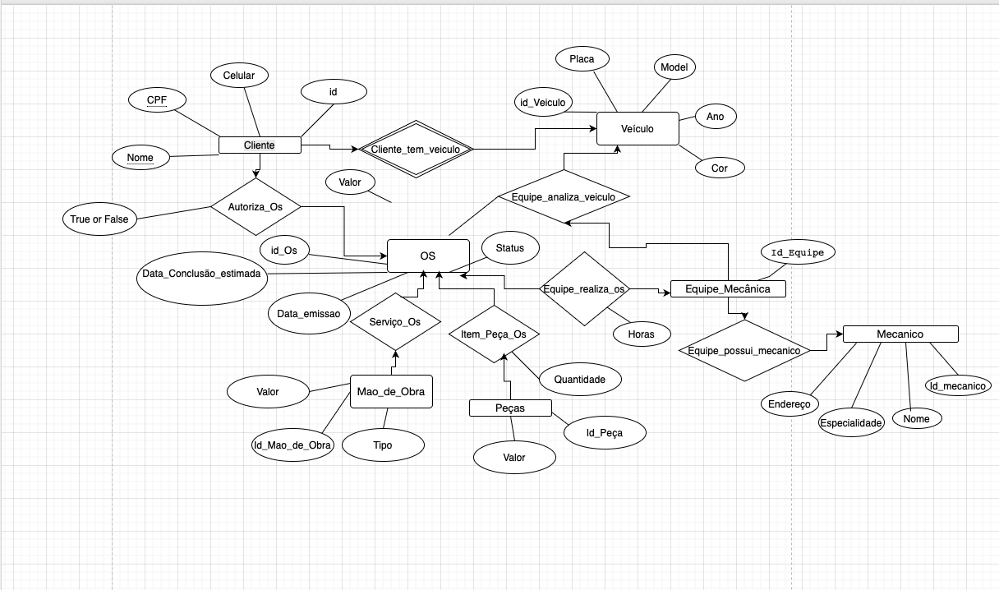

# 🛠️ Mechanic Shop Database

Este projeto representa o modelo conceitual e a estrutura relacional de um **sistema de gerenciamento de ordens de serviço para uma oficina mecânica**. A proposta foi desenvolvida como parte de um desafio técnico e visa demonstrar habilidades em modelagem de banco de dados relacional e implementação SQL.

---

## 🧠 Contexto do Desafio

**Narrativa proposta:**

> Clientes levam seus veículos a uma oficina para manutenção ou revisão. Cada veículo é designado a uma equipe de mecânicos que realiza a análise técnica e executa os serviços necessários. Uma ordem de serviço (OS) é criada para cada atendimento, contendo prazos, status, peças e serviços. O cliente precisa autorizar a execução. Os valores das ordens são calculados com base nas peças e mão de obra utilizados.

---

## 📌 Objetivos do Projeto

- Modelar um banco de dados relacional completo com base em uma narrativa realista.
- Criar um modelo conceitual (diagrama ER).
- Escrever e executar um script SQL contendo a criação de todas as tabelas, relacionamentos e restrições.

---

## 📊 Modelo Conceitual



O modelo representa as seguintes entidades principais:

- **Clientes**: nome, telefone, CPF.
- **Veículos**: placa, modelo, ano, cor.
- **Funcionários (Mecânicos)**: nome, CPF, endereço, especialidade.
- **Equipes de Mecânicos**: formadas por vários funcionários.
- **Ordens de Serviço**: associadas a veículos, equipes, status e datas.
- **Serviços** e **Peças**: vinculados à OS por tabelas associativas com `horas` e `quantidade`, respectivamente.
- **Autorização de execução**: cliente aprova ou não a execução de serviços.

---

## 🧱 Estrutura do Banco de Dados

O banco de dados é implementado no script [`Mechanic_Shop.sql`](Mechanic_Shop.sql), e contém as seguintes tabelas:

- `Customers`
- `Vehicles`
- `Employees`
- `Teams`
- `Employee_Team`
- `Order_of_Services`
- `Services`
- `Parts`
- `Service_OS` (tabela associativa entre OS e serviços, com horas)
- `Parts_OS` (tabela associativa entre OS e peças, com quantidade)
- `Orders_Authorization` (cliente autoriza a OS)

### Destaques técnicos:
- Uso de **chaves primárias compostas** em tabelas associativas.
- Uso de **FOREIGN KEYS** para garantir integridade referencial.
- Enumeração de status (`ENUM('Aberta', 'Pendente', 'Concluída')`) para a OS.
- `BOOLEAN` para indicar autorização da OS.

---

## 💻 Como utilizar

1. Clone o repositório:
```bash
git clone https://github.com/seu-usuario/Mechanic_Shop.git
```

2. Abra o script no seu ambiente SQL preferido (ex: MySQL Workbench).

3. Execute o script `Mechanic_Shop.sql` para criar o schema e as tabelas.

---

## 🧠 Lógica de Autorização no Mundo Real

Em um sistema real de oficina, a **ordem de serviço (OS)** geralmente é criada com o status inicial **"Pendente"**, e só deve ser executada pela equipe mecânica após a **autorização do cliente**.

No backend da aplicação (por exemplo, uma API feita com Flask ou Node.js), podemos implementar essa lógica de forma clara e segura.

### 🔄 Fluxo Real de Autorização

1. A oficina avalia o veículo e cria a OS com os serviços sugeridos.
2. O cliente recebe a OS para revisão (por e-mail, aplicativo ou site).
3. O cliente autoriza ou recusa a execução.
4. O sistema atualiza automaticamente o status da OS com base na resposta.

---

### 🧩 Exemplo de Lógica no Backend (em Python) para uso

```python
def autorizar_ordem(id_os, id_cliente, autorizou):
    # 1. Registrar a resposta do cliente na tabela de autorização
    cursor.execute("""
        INSERT INTO Orders_Authorization (id_Customer, id_Order_of_Service, Authorization)
        VALUES (%s, %s, %s)
    """, (id_cliente, id_os, autorizou))

    # 2. Definir o novo status da OS com base na resposta
    novo_status = "Em execução" if autorizou else "Cancelada"

    # 3. Atualizar a OS no banco
    cursor.execute("""
        UPDATE Order_of_Services
        SET Status = %s
        WHERE id_Order_of_Service = %s
    """, (novo_status, id_os))
```

---

### ✅ O que esse código faz:

- Registra a **resposta do cliente** na tabela `Orders_Authorization`.
- Verifica se o cliente **autorizou ou não** a execução dos serviços.
- Atualiza o **status da OS automaticamente**:
  - `Em execução` → se o cliente aprovou.
  - `Cancelada` → se o cliente recusou.

---

### 💼 Vantagens dessa abordagem no backend:

- Centraliza a **lógica de negócio** fora do banco de dados.
- Permite integrar com **sistemas de notificação** (ex: envio de e-mail ou SMS).
- Permite adicionar **validações e autenticação** (ex: garantir que só o cliente certo pode autorizar).
- Facilita a manutenção e evolução do sistema (ex: trocar regras sem alterar o banco).


## 👨‍💻 Autor

**João Pedro Fialho Lopes**  
Estudante de Tecnologia da Informação | Transição de carreira para dados  
GitHub: [@Jotabelde](https://github.com/Jotabelde)

---

## 📄 Licença

Este projeto é livre para uso educacional e não possui fins comerciais.

---
